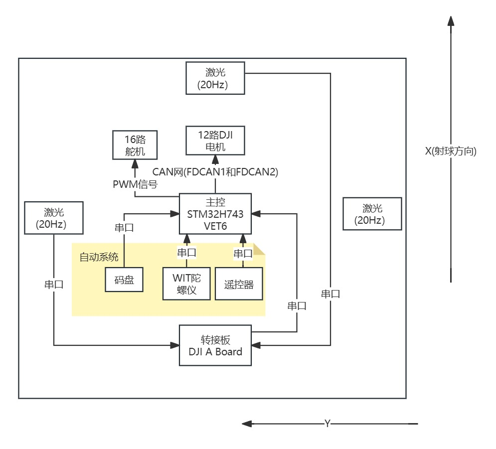
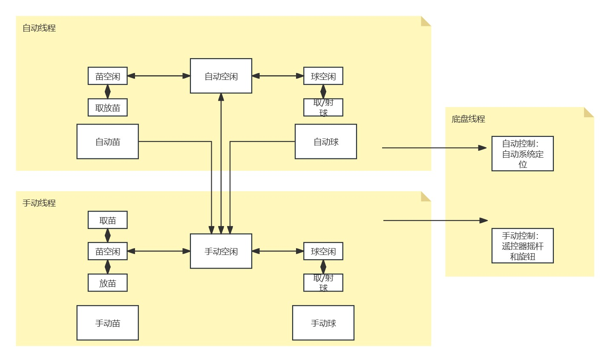

# WTR_R1 

## 工程简介

第23届全国大学生机器人大赛ROBOCON，哈尔滨工业大学（深圳）南工问天战队R1整车工程。

```
.
|- MainBoard 	## 主控板工程
|- ServoBoard	## DJI A Board工程
|- Readme.md	## 工程介绍
```

## 机械部分简介

整车采用双夹爪取放苗(带存苗)+夹爪摩擦轮取射球方案。

## 电控部分简介

整车采用STM32H743VET6(极客科技)进行控制，附加的DJI A Board作为激光转接板使用。

- 整车电控系统如下：



- 整车代码结构如下：

```
.
|- Usercode 	
	|-	Lib			## 传感器和电机底层驱动，硬件驱动层
	|-  Middleware	## 传感器线程和底盘线程封装，主要封装为初始化函数和运行线程(电机发消息和传感器消息处理)，中间层
		|- Chassis	## 底盘控制线程，电机信息发送线程
		|- Callback	## 回调函数，硬件驱动层的回调函数使用weak弱定义
	|-	APP 		## 自动/手动取球，射球，取苗，放苗线程封装，应用层
	|- 	User		## 用户层
		|- usermain			## 总初始化线程
		|- usermain_task	## 系统总状态机
		|- userconfig		## 系统通用参数
```

- 整车系统状态机如下，手动优先级是最高的。



- 整车的定位算法

整车的定位算法是PD控制的定位，由于是PD控制，当前点和目标点的距离不能过大，如果目标过大会导致系统不稳定。

在取苗过程中，由于车的一侧是靠着苗架的（码盘精度差，纯粹靠码盘贴近苗架会导致取不到苗），所以此时设定的目标点在苗架以内以保证整车贴紧苗架实行限位，由此车会向苗架产生一个向内的力，由于这个力可能会导致依靠全向轮摩擦移动的底盘凭借PD控制而难以运动，所以检测到卡住苗架时会向系统中加入I值（定位结束后去掉），使得系统依靠I缓慢到达取苗点。

在放苗过程中，首先使用码盘粗定位，然后使用激光精定位（这个20Hz激光需要1.2s以获得稳定数据）。

> PID用于底盘定位不是很可靠，但是现有的速度规划算法（S型和梯形速度规划）是无反馈的，能否考虑使用有反馈的速度规划算法是个问题。

- Bug

1. 这个系统的倒插板作为功率板无法满足16路舵机的电流需求，前期调试时经常导致系统直接由于电压不稳复位。
2. H7无法匹配ADS1256的SPI时序，故放弃使用DT35为激光方案。
3. CAN网负载太大了，容易出现偶发性断连。
4. 天线一直是松的，导致手动控制延时。
5. 2006堵转时会报错，但是3508不会。系统采用的检测电机到达位置使用的是无限延时，可以考虑使用定时检测后自动放弃检查避免线程堵死。

## 注意事项

### 电控/硬件注意事项

- 硬件制板前，电控组需要对全部的传感器和电机进行测试并使用CubeMX进行需求整理。**硬件组需要严格遵守电控组给出的需求进行主控板制作，不得擅自更改电控组要求**。

- 电源

  > - 主控板和分线/大功率驱动板应当产生电气隔离，避免大功率驱动板(如舵机驱动板)对主控造成不利影响。
  > - 建议使用双电源供电，小电源对主控板供电，大电源对功率板供电。
  > - 硬件设计时应当考虑电机堵转/舵机堵转产生的电流冲击。

- 通信

  > - CAN网负载不宜过多，8个以下为宜。使用CAN网时，检查终端电阻是否匹配。CAN线应当使用双绞线减少电磁干扰。避免形成大回环。
  > - SPI通信抗扰能力差，不建议使用SPI通信。
  > - 无线通信尽量使用不常用频段(2.4GHz以外)并使用大功率天线(20dBm以上)，**因为备赛场和主场的电磁环境及其复杂，容易导致丢包。**
  > -  AS69转接板建议直接焊在主控上，接线不良会导致丢包。

### 电控/机械注意事项

- 接线

> - 机械应当为电控提供走线和安放主控板的空间，主控板应当固定在底盘上，走线应当沿有减重孔的铝管进行布线，二者都应当避开存在运动的机构。
> - 如果存在直径较为细的线，应当用缠绕管进行保护防止意外断裂。
> - 尽量不要存在不等长的线以避免长线弯曲。
> - 尽量使用有卡扣的插口(XH,XT)或者用螺纹固定的插口。
> - 尽量使用粗线而非细线。
> - 尽量避免使用杜邦线，如果存在杜邦线，插口应当存在防止脱落的限位或者使用胶接。
> - 线的长度不宜太长（辨识困难），也不宜太短（容易断裂）。
> - 天线应当避开走线密集的区域，比如接在车顶。
> - 如果存在运动机构走线，使用(a)滑环(线要够粗，适用于旋转机构) (b)坦克带(线要够长，适用于平动机构) 
> - 尽量使用螺栓固定的**压线端子**，弹簧结构的接线端子容易接触不良。弹簧结构的接线端子适用于(a)粗线 (b)杜邦线公头线。
> - 如果发生意外断裂的线，修复时应当考虑稳定性。
> - 焊线必须加固焊接部分与两侧胶皮，防止反复弯折导致金属疲劳意外损伤线缆。

- 机械设计

> - **电控逻辑越简单越快。** 所以当电控组提出的"XX比XX快"之类的要求时，机械组应当考虑此问题。
> - 机械组应当和电控组有充分交流，电控组能够帮助机械组改进机构。
> - 尽量减小电流冲击，提倡使用气动元件减少电流冲击，电机/舵机堵转及其容易产生电流冲击。
> - **上层机构以简单为重点，上层机构越复杂，实现难度越高，失败率越大(参考另一台摩擦带取苗的R1)。**
> - **上层机构注意细节，版本迭代时不要大改而是从细节上解决问题。**
> - 底盘及其重要，好的底盘是半自动的支撑。

### 电控组注意事项

- 代码习惯

> - 代码建议分层编写，从**底层驱动->中间层接口->应用层动作->用户系统架构**进行编写。
> - 初期代码要使得机构慢速，便于看出机构问题。
> - 可以使用全局变量，但是要符合命名规范。
> - **代码需要注释！！！**
> - 如果有两个人以上负责工程，应当事先沟通好工程接口和通信协议。

- 主控

> - 使用F系列进行主控是比较可靠的，H系列由于架构变化，使用时可能会产生某些意想不到的bug。
> - 如果此车可手动，一定先进行手动逻辑测试和手动/自动切换系统构建。**底盘控制不可靠的情况下，手动必然比自动快速。**
> - 全向轮控制分为平移和方向控制，注意**方向控制应留有40%以上的速度余量**。
